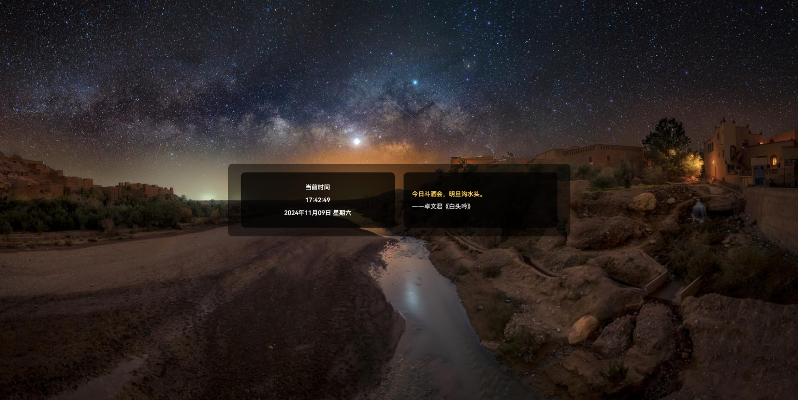

<!-- 项目 LOGO -->
 

  

<h3 align="center">MyHomePage</h3>

  

    我的个人主页 属于自己的小破站~
  

  [![贡献者][投稿人包庇]][贡献者网址]
  [![分叉][分叉包庇]][分叉网址]
  [![星标][星标包庇]][星标网址]
  [![问题][问题包庇]][问题网址]
  [![MIT 许可证][许可证包庇]][许可证网址]

  

    <a href="https://phantompixel.pages.dev"><strong>前往查看 »</strong></a>
     
        <a href="https://github.com/PhantomPixel-0418/MyHomePage/issues/new?labels=bug&template=bug-report---.md">报告错误</a>
    ·
    <a href="https://github.com/PhantomPixel-0418/MyHomePage/issues/new?labels=enhancement&template=feature-request---.md">提供建议</a>
  

<!-- 目录 -->

  
目录

  <ol>
    <li>
      <a href="#关于项目">关于项目</a>
    </li>
    <li><a href="#路线图">路线图</a></li>
    <li><a href="#许可证">许可证</a></li>
    <li><a href="#致谢">致谢</a></li>
  </ol>

<!-- 关于项目 -->
## 关于项目

网站截图
<a href="https://github.com/PhantomPixel-0418/MyHomePage">
    

(<a href="#readme-top">返回顶部</a>)

<!-- 路线图 -->
## 路线图

- [x] Bing 每日一图
- [x] 名言
- [x] 显示时间
  - [x] 日期
- [ ] 天气信息
  - [ ] 气候提示

有关建议功能（和已知问题）的完整列表，请参阅 [开启的问题](https://github.com/PhantomPixel-0418/MyHomePage/issues)。

(<a href="#readme-top">返回顶部</a>)

<!-- 许可证 -->
## 许可证

以 MIT 许可发布。更多信息请参见 [`LICENSE.txt`](LICENSE)。

(<a href="#readme-top">返回顶部</a>)

### 致谢

以下是网页中使用到的资源和接口列表：

#### SVG 图像来源
- [HarmonyOS 主题图标库](https://developer.huawei.com/consumer/cn/design/harmonyos-symbol/HarmonyOS)  
  描述：由华为开发者联盟提供的图标素材，设计简洁现代，适用于网页的装饰和功能指示。

#### 世界时间 API
- **接口地址**：`http://worldtimeapi.org/api/ip`  
  描述：此 API 根据用户的 IP 地址获取当前时间和时区信息，确保时间的准确性。  
  用途：在页面加载时获取准确的初始时间，之后每秒通过本地更新。

#### 今日诗词 API
- **接口地址**：`https://v1.jinrishici.com/all.json`  
  描述：提供随机的经典诗词名句，包括作者和出处。  
  用途：在网页上显示每日一言的内容，作为网页上的激励语句。

#### 新的 Bing 壁纸接口
- **接口地址**：`https://api.vvhan.com/article/bing.html`  
  描述：此 API 提供每日 Bing 壁纸及其详细信息，包括标题和日期等。  
  用途：用于动态显示网页背景图片，并提供图片的相关描述。

#### 字体来源
1. **Rousseau Deco**  
   描述：用户指定用于显示时间的艺术字体，提升网页视觉美感。
2. **Alimama DongFang DaKai Regular**  
   描述：用户指定用于显示名言名句的字体，风格简洁，传递优雅氛围。
3. **HarmonyOS Sans**  
   描述：网页默认字体，保持整体风格一致性，由华为开发者联盟提供。  
   来源：[HarmonyOS Sans 字体下载](https://developer.huawei.com/consumer/cn/doc/development/graphics-Guides/fonts-0000001050731439)

(<a href="#readme-top">返回顶部</a>)

#### 其他致谢：
感谢 Cloudflare 提供的 **Web Analytics** 工具，用于统计网站访问流量和分析用户行为。

感谢 Best-README-Template 提供的 **自述文件模版**，用于更方便地编写自述文件。

(<a herf="#readme-top">返回顶部</a>)

<!-- 标记链接和图像 -->
<!-- https://www.markdownguide.org/basic-syntax/#reference-style-links -->

[投稿人包庇]: https://img.shields.io/github/contributors/PhantomPixel-0418/MyHomePage.svg
[贡献者网址]: https://github.com/PhantomPixel-0418/MyHomePage/graphs/contributors
[分叉包庇]: https://img.shields.io/github/forks/PhantomPixel-0418/MyHomePage.svg?style
[分叉网址]: https://github.com/PhantomPixel-0418/MyHomePage/network/members
[星标包庇]: https://img.shields.io/github/stars/PhantomPixel-0418/MyHomePage.svg?style
[星标网址]: https://github.com/PhantomPixel-0418/MyHomePage/stargazers
[问题包庇]: https://img.shields.io/github/issues/PhantomPixel-0418/MyHomePage.svg
[问题网址]: https://github.com/PhantomPixel-0418/MyHomePage/issues
[许可证包庇]: https://img.shields.io/github/license/PhantomPixel-0418/MyHomePage.svg
[许可证网址]: https://github.com/PhantomPixel-0418/MyHomePage/blob/master/LICENSE.txt
